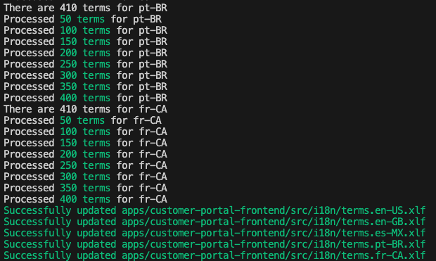

# XLF Translator

An XLF translator which auto-translates your XLF files into the target locales

## Feedback

If something doesn't work as expected, leave an issue here:  
https://github.com/js-boost/js-boost/issues

## Installation

`npm i @js-boost/xlf-translator --save-dev`

## Import

`import import { XlfTranslator } from @js-boost/xlf-translator`

## Usage

Before you can start XlfTranslator, you need to define 3 things:

1. `inputXlfFilePath` - The path to the source XLF file, which is going to be the source of the translations
2. `localeFiles` - Definitions of the target locales, including their file paths.
3. `translate` - A translate function, so you can customize it and use the service which you wish (e.g. GoogleTranslate, Deepl, etc.)

`translate` has to implement the following API:

```ts
export function translate (
  sourceText: string,
  targetLocale: string,
  sourceLocale?: string
): Promise<string> {
```

Create a new file four your script and call it something like this:

> `translate-xlf.ts`

```ts
import { XlfTranslator, LocaleFile } from './translator';
import { translate } from './translate.func';

// Preparing params
const i18nFolder = `app/src/i18n`;
const inputXlfFilePath = `${i18nFolder}/terms.xlf`;
const localeFiles: LocaleFile[] = [
  { locale: 'en-US', filePath: `${i18nFolder}/terms.en-US.xlf` },
  { locale: 'es-MX', filePath: `${i18nFolder}/terms.es-MX.xlf` },
  ...
];

// Usage
const translator = new XlfTranslator(
  inputXlfFilePath,
  localeFiles,
  translate
);
translator.start();
```

Execute it like this:

> `ts-node translate-xlf.ts`

And watch the results:

